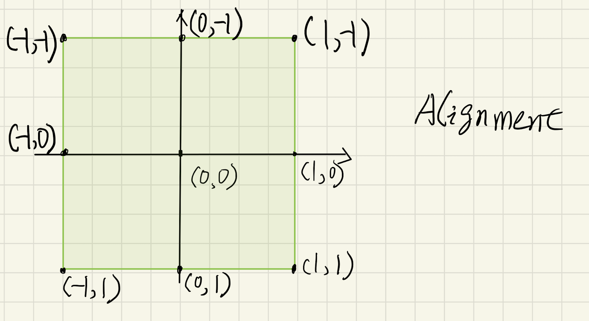
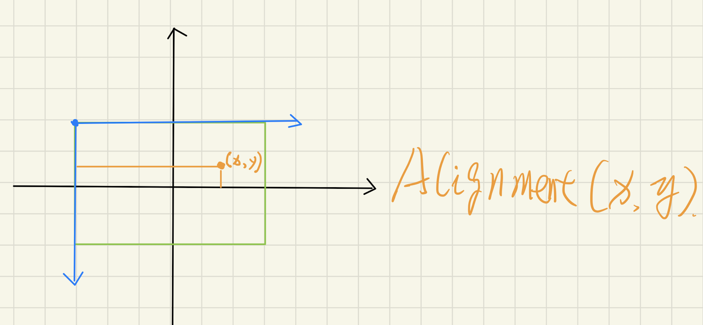
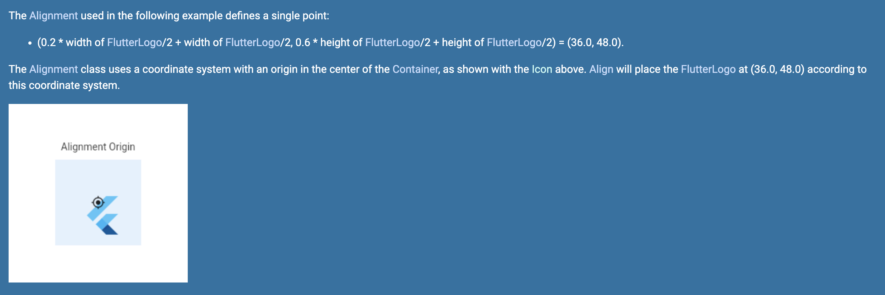
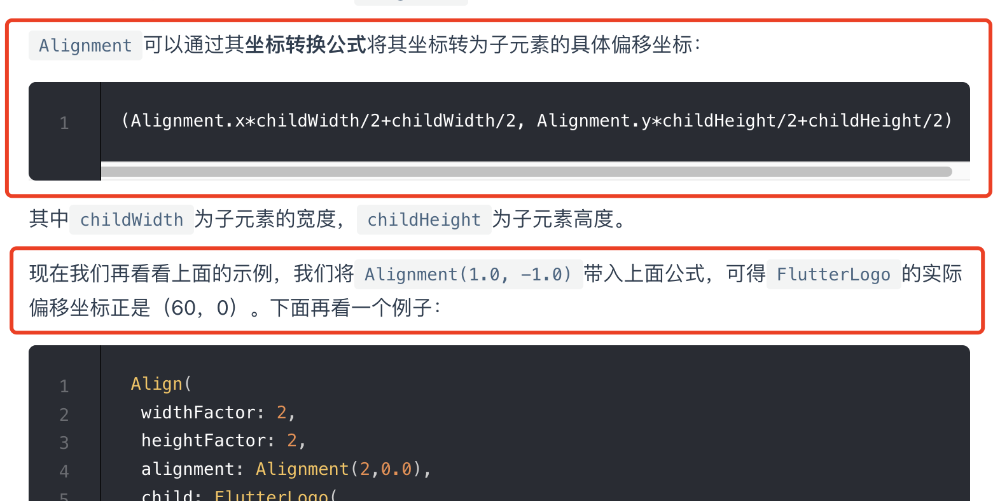
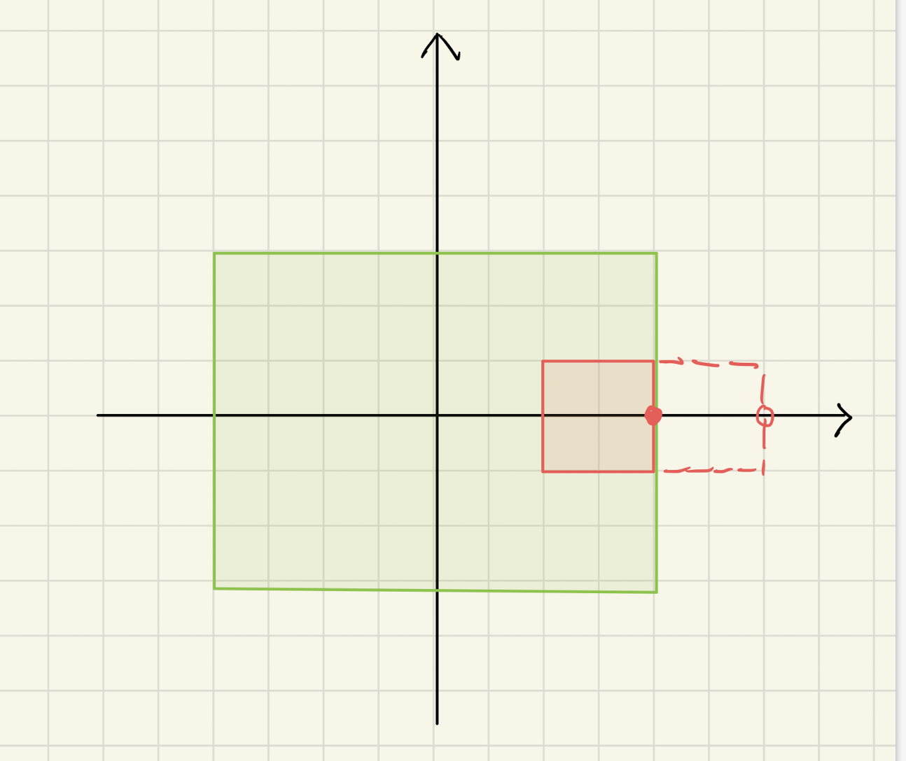

我们在开发中会经常使用 Align 组件来定位子组件的位置。通常使用的是几个常用的相对位置，比如：`alignment: Alignment.bottomRight`，右下角这种。最近看官方文档关于 `alignment: Alignment(x, y)` 在 Align 中的计算解释好像有点不对，再结合相关的源码，总算是弄清楚了。然后发现网上的教程解释大多有错误，下面就来分享下我对 Align 对齐原理的理解。

## 前置知识：Alignment

[Alignment](https://api.flutter.dev/flutter/painting/Alignment-class.html) 的工作方式是先在一个矩形中建立一个虚拟坐标系，这个虚拟坐标系的原点是矩形的中点，然后 (x, y) 是在这个虚拟坐标系中的定位点，并且规定了 (x, y) 的数值代表的是相对值，比如 Alignment(0.0, 0.0) 是中点，Alignment(1.0, 1.0) 是右下角，如图所示：



(x, y) 中的 x 这个相对值的单位是**矩形宽度的一半**，比如 2.0 就相当于整个矩形宽度了；y 也是类似的，y 的单位是矩形高度的一半。

再通过一个公式转化为以矩形左上角为原点的坐标系中的定位点。这个转换公式如下：`(x * w/2 + w/2, y * h/2 + h/2)`，其中 w 是矩形的宽度，h 是矩形的高度。结合下面的示意图来理解一下计算过程：



绿色框的是这个矩形，黑色坐标轴是虚拟坐标系，蓝色坐标轴是以矩形左上角为原点的目标坐标系。以虚拟坐标轴上横坐标 x 为例，转换后的目标点横坐标 x' = 矩形宽度的一半 加上 x * 矩形宽度的一半（虚拟坐标轴中 x 的单位是矩形宽度的一半）。

比如，Alignment(2.0, 0.0) 这个点转换后横坐标的值是 1.5 倍的矩形宽度，可不是两倍的矩形宽度喔。

## Align 是怎么工作的

在 Align 的官方文档中有这样一句话：

> **How it works**
>
> The [alignment](https://api.flutter.dev/flutter/widgets/Align/alignment.html) property describes a point in the `child`'s coordinate system and a different point in the coordinate system of this widget. The [Align](https://api.flutter.dev/flutter/widgets/Align-class.html) widget positions the `child` such that both points are lined up on top of each other.

意思是说，先利用 alignment 属性的描述求出在子组件坐标系的一个点和在 Align 组件坐标系中的另一个点；然后 Align 将子组件放置在使这两个点重合的位置上。

### 错误的解释

从以上描述可以看出，最后的放置坐标是跟 Align 的大小也是有关系的，因为过程中要用 alignment 来计算 Align 中的一个点。但我从官方文档的示例说明中只看到计算跟子组件相关：



并且我在网上看到的一些教程的解释，也是错误的，比如这个：



要证明这个错误很简单，将 Align 放置在一个 Container 中，然后把 alignment 设置为 Alignment(1.0, 0.0)，再随便放置一个子组件，比如这样：

```dart
Container(
  height: 120,
  width: 200,
  color: Colors.green.withOpacity(0.6),
  child: Align(
    alignment: Alignment(1.0, 0.0),
    child: Container(
      width: 60,
      height: 60,
      color: Colors.red,
    ),
  ),
),
```

你会发现不管怎么改变外面 Container 的宽度，里面红色矩形的右边始终是和外面 Container 的右边是重合的。如果定位的坐标只与子组件的宽度相关，这是如何做到的呢？

### 我的理解

官方文档中 how it works 已经给出了计算的原理，但是没有给出具体的公式。我看了下相关源码证实了 how it works 的描述是没有问题的，下面我用一个简单的例子来说明下计算的过程，并给出正确的计算公式。



上图中绿色矩形是 Align 的大小，红色是子组件，我还是用 Alignment(1.0, 0.0) 来说明。Alignment(1.0, 0.0) 所描述的点的横坐标在绿色矩形和红色矩形中都在右边框那里，如果 Align 按照这个位置来定位子组件的话，红色矩形应该在红色虚线框那里。但根据 how it works 的描述，Align 放置子组件时会使两个点重合，也就是红色矩形右边框的点与绿色矩形右边框的点重合。这个时候我们只需要从红色虚线框的位置移动到实线框的位置，也就是：Align 中定位点的横坐标 **减去** 子组件中定位点的横坐标：

```dart
alignWidth / 2 + x * (alignWidth / 2) - childWidth / 2 - x * (childWidth / 2)
```

对于坐标的 y 值也可以用类似的过程来描述，所以最终定位点的计算公式应该是：

```dart
var x = (alignWidth - childWidth) / 2 + x * ((alignWidth - childWidth) / 2);
var y = (alignHeight - childHeight) / 2 + x * ((parentHeight - childHeight) / 2);
```

最后，如果 alignment 是 FractionalOffset 也可以用类似的过程来描述定位。FractionalOffset 与 Alignment 的不同在于虚拟坐标系中 FractionalOffset 的原点在矩形左上角，并且 FractionalOffset(x, y) 中 x 的单位是矩形的整个宽度，不是一半。在 Align 中定位依然遵循两个 FractionalOffset 的点要保持重合。